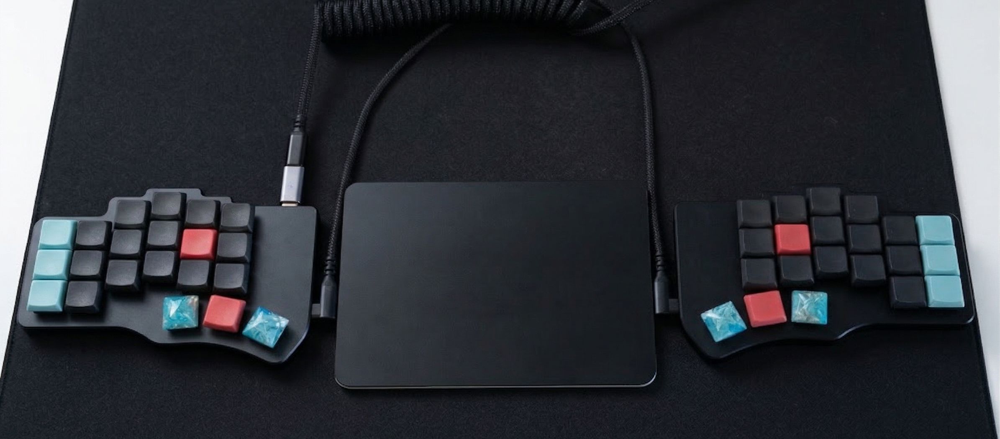

# heavy-handed

A 42-key split keyboard layout for the Piantor Pro with Nocturnal Silent Linear 20g switches.
The switches activate if you breathe on them. The name is aspirational.



Vial firmware. Load `piantor-pro-heavy-handed.vil` in [Vial](https://get.vial.today/) and flash.

Read the full story: [Twelve Keyboards Later](https://jorypestorious.com/blog/endgame-keyboard/)

---

## Philosophy

Every key serves one purpose. No redundant layers.

The six thumb keys handle five layers and the five most frequent non-alpha keys
(Backspace, Space, Tab, Escape, and mouse click). Modifiers stay on the outer pinky columns:
Ctrl (top left), Cmd (home left), Alt (top right), Shift-parens (bottom both).

The right outer thumb is Escape on tap, Hyper (all four modifiers) on hold.
Escape is the most common single-key action in vim and tmux.
Hyper gives skhd a dedicated modifier namespace for app launching, separate
from Alt (window management) and Ctrl (tmux).

**Ghost glyph protection:** the inner column keys (T/G/B and Y/H/N positions)
are blank on most layers. Insert used to live on the G position of L2, and it
fired constantly. Blanking the inner column on layers where it serves no purpose
fixed the problem. The inner column still carries content on some layers (L1 puts
brackets on Y and equals on H; L3 puts symbols across the right inner column)
where those keys are intentional targets.

**Why not home row mods?** At 20g actuation force, fingers rest on the keys with
enough pressure to register. Fast typing holds keys for 100-150ms during normal
rollover, which overlaps with the tapping term threshold. The firmware cannot
reliably distinguish "typing A quickly" from "starting to hold Cmd." Dedicated
modifier keys have no timing ambiguity. Ctrl is always Ctrl.

---

## Base Layer

```
+-----+-----+-----+-----+-----+-----+          +-----+-----+-----+-----+-----+-----+
|Ctrl |  Q  |  W  |  E  |  R  |  T  |          |  Y  |  U  |  I  |  O  |  P  | Alt |
+-----+-----+-----+-----+-----+-----+          +-----+-----+-----+-----+-----+-----+
| Cmd |  A  |  S  |  D  |  F  |  G  |          |  H  |  J  |  K  |  L  |  ;  |  '  |
+-----+-----+-----+-----+-----+-----+          +-----+-----+-----+-----+-----+-----+
|Sft/(|  Z  |  X  |  C  |  V  |  B  |          |  N  |  M  |  ,  |  .  |  /  |Sft/)|
+-----+-----+-----+-----+-----+-----+          +-----+-----+-----+-----+-----+-----+
                    +-----+-----+-----+    +-----+-----+-----+
                    | Tab |BkSp |Enter|    |Click|Space| Esc |
                    | L5  | L1  | L3  |    | L4  | L2  |Hyper|
                    +-----+-----+-----+    +-----+-----+-----+
```

**Left outer column:** Ctrl (top), Cmd (home), Shift/( (bottom).
Cmd on left home pinky keeps one-handed Cmd+ZXCV comfortable.

**Right outer column:** Alt (top), quote (home), Shift/) (bottom).

**Left thumbs:** Tab/L5, Backspace/L1, Enter/L3.
Tab on the outer thumb because it is used constantly. Del lives on L2.

**Right thumbs:** Click/L4, Space/L2, Esc/Hyper.
The right inner thumb taps left-click and holds for the mouse layer.

---

## Layers

| Hold | Layer | Purpose |
|------|-------|---------|
| Backspace | L1 Num | Numbers, brackets |
| Space | L2 Nav | Arrows, editing, all tmux controls |
| Enter | L3 Sym | Shifted symbols, yabai window management |
| Right inner thumb | L4 Mouse | Mouse movement, scroll, buttons |
| Tab | L5 Fn | F-keys, media, brightness |

### L1 Num (hold Backspace)

Right hand numpad with brackets. Left hand has format separators, bracket pairs,
and math operators for number-adjacent input without leaving the numpad.

```
+-----+-----+-----+-----+-----+-----+          +-----+-----+-----+-----+-----+-----+
|Ctrl |  {  |  (  |  )  |  }  |     |          |  [  |  7  |  8  |  9  |  ]  | Alt |
+-----+-----+-----+-----+-----+-----+          +-----+-----+-----+-----+-----+-----+
| Cmd |  $  |  .  |  ,  |  :  |     |          |  =  |  4  |  5  |  6  |  ;  |  '  |
+-----+-----+-----+-----+-----+-----+          +-----+-----+-----+-----+-----+-----+
|Sft/(|  /  |  *  |  +  |  %  |     |          |  \  |  1  |  2  |  3  |  `  |Sft/)|
+-----+-----+-----+-----+-----+-----+          +-----+-----+-----+-----+-----+-----+
                    +-----+-----+-----+    +-----+-----+-----+
                    |     |(hld)|     |    |  -  |  0  |  .  |
                    +-----+-----+-----+    +-----+-----+-----+
```

**Left hand home row (ASDF):** `$` `.` `,` `:` for currency, decimals, thousands
separators, and times. Enter numbers with the right hand, punctuate with the left.

**Left hand top row (QWER):** `{` `(` `)` `}` for grouping expressions while on the numpad.

**Left hand bottom row (ZXCV):** `/` `*` `+` `%` for math and percentages.

### L2 Nav + tmux (hold Space)

Left hand: arrows and editing. Right hand: all tmux controls.

```
+-----+-----+-----+-----+-----+-----+          +-----+-----+-----+-----+-----+-----+
|Ctrl |Home |PgDn |PgUp | End |     |          |     |splth|spltv|zoom |copy | Alt |
+-----+-----+-----+-----+-----+-----+          +-----+-----+-----+-----+-----+-----+
| Cmd |Left |Down | Up  |Right|     |          |prevW|nextS|prevS|nextW|sesh |     |
+-----+-----+-----+-----+-----+-----+          +-----+-----+-----+-----+-----+-----+
|Sft/(|Cmd+Z|Cmd+X|Cmd+C|Cmd+V|CmdSZ|          |     | git | jump|newWn| yazi|     |
+-----+-----+-----+-----+-----+-----+          +-----+-----+-----+-----+-----+-----+
                    +-----+-----+-----+    +-----+-----+-----+
                    | Del |BkSp |Enter|    |     |(hld)|     |
                    +-----+-----+-----+    +-----+-----+-----+
```

**Home row (HJKL + sesh):**
H = prev window, L = next window (horizontal).
J = next session, K = prev session (vertical).
; = sesh session picker. Spatial like vim.

**Top row (workspace actions):**
U = split horizontal, I = split vertical, O = zoom, P = copy mode.

**Bottom row (launchers):**
M = lazygit, , = zoxide jump, . = new window, / = yazi file manager.

### L3 Sym + yabai (hold Enter)

Right hand shifted symbols. Left hand yabai window management.

```
+-----+-----+-----+-----+-----+-----+          +-----+-----+-----+-----+-----+-----+
|Ctrl |rsz← |rsz↓ |rsz↑ |rsz→ |     |          |  {  |  &  |  *  |  (  |  }  | Alt |
+-----+-----+-----+-----+-----+-----+          +-----+-----+-----+-----+-----+-----+
| Cmd |fcs← |fcs↓ |fcs↑ |fcs→ |     |          |  +  |  $  |  %  |  ^  |  :  |  "  |
+-----+-----+-----+-----+-----+-----+          +-----+-----+-----+-----+-----+-----+
|Sft/(|swp← |swp↓ |swp↑ |swp→ |     |          |  |  |  !  |  @  |  #  |  ~  |Sft/)|
+-----+-----+-----+-----+-----+-----+          +-----+-----+-----+-----+-----+-----+
                    +-----+-----+-----+    +-----+-----+-----+
                    |full |rotat|(hld)|    |  _  |  (  |  )  |
                    +-----+-----+-----+    +-----+-----+-----+
```

**Left hand home row (ASDF):** Alt+HJKL = focus window in that direction.
Same spatial mapping as L2 arrows. A=west, S=south, D=north, F=east.

**Left hand bottom row (ZXCV):** Shift+Alt+HJKL = swap window position.

**Left hand top row (QWER):** Ctrl+Alt+HJKL = resize window.

**Left thumbs:** fullscreen toggle (outer), rotate layout 90 degrees (middle).

### L4 Mouse (hold right inner thumb)

Left hand controls cursor and scroll. Right hand has one-handed editing
shortcuts for use while mousing.

```
+-----+-----+-----+-----+-----+-----+          +-----+-----+-----+-----+-----+-----+
|Ctrl |Scr L|Scr D|Scr U|Scr R|     |          |     |newTb|close|save |slAll| Alt |
+-----+-----+-----+-----+-----+-----+          +-----+-----+-----+-----+-----+-----+
| Cmd |Mse L|Mse D|Mse U|Mse R|     |          |     |undo | cut |copy |paste|     |
+-----+-----+-----+-----+-----+-----+          +-----+-----+-----+-----+-----+-----+
|     |     |     |     |     |     |          |     |redo |find |     |     |     |
+-----+-----+-----+-----+-----+-----+          +-----+-----+-----+-----+-----+-----+
                    +-----+-----+-----+    +-----+-----+-----+
                    | Mid |Click|Right|    |(hld)|     |     |
                    +-----+-----+-----+    +-----+-----+-----+
```

**Left hand:** cursor movement (home row), scroll (top row), click buttons (thumbs).

**Right hand home row:** Cmd+Z undo, Cmd+X cut, Cmd+C copy, Cmd+V paste.
**Right hand top row:** Cmd+T new tab, Cmd+W close tab, Cmd+S save, Cmd+A select all.
**Right hand bottom row:** Cmd+Shift+Z redo, Cmd+F find.

### L5 Fn + Media (hold Tab)

F-keys on right. Media on left home row. Brightness on right pinky.

```
+-----+-----+-----+-----+-----+-----+          +-----+-----+-----+-----+-----+-----+
|     |     |     |     |     |     |          |     | F7  | F8  | F9  | F12 |ScSht|
+-----+-----+-----+-----+-----+-----+          +-----+-----+-----+-----+-----+-----+
|     |Mute |Vol- |Vol+ |Play |     |          |     | F4  | F5  | F6  | F11 |Bri+ |
+-----+-----+-----+-----+-----+-----+          +-----+-----+-----+-----+-----+-----+
|     |     |     |     |     |     |          |     | F1  | F2  | F3  | F10 |Bri- |
+-----+-----+-----+-----+-----+-----+          +-----+-----+-----+-----+-----+-----+
                    +-----+-----+-----+    +-----+-----+-----+
                    |(hld)|     |     |    | M0  | M1  | M2  |
                    +-----+-----+-----+    +-----+-----+-----+
```

**Left ASDF:** Mute, Vol-, Vol+, Play.
Natural left-to-right: toggle, down, up, toggle.

**Right pinky:** Screenshot (top), Bri+ (home), Bri- (bottom).
Brightness next to screenshot since both are display controls.

**Right thumbs:** M0 Raycast, M1 Wispr, M2 tmux prefix.

---

## Macros

All 16 slots used. Tmux macros send the prefix (Ctrl+A) then the command key,
matching `~/.config/tmux/tmux.conf` bindings exactly.

| Slot | Keys | Purpose | Layer | Position |
|------|------|---------|-------|----------|
| M0 | RAlt+Space | Raycast launcher | L5 | right thumb outer |
| M1 | LAlt+D | Wispr transcription | L5 | right thumb middle |
| M2 | Ctrl+A | tmux prefix (raw) | L5 | right thumb inner |
| M3 | Ctrl+A, [ | tmux copy mode | L2 | P position |
| M4 | Ctrl+A, - | tmux split horizontal | L2 | U position |
| M5 | Ctrl+A, \| | tmux split vertical | L2 | I position |
| M6 | Ctrl+A, z | tmux zoom pane | L2 | O position |
| M7 | Ctrl+A, g | lazygit popup | L2 | M position |
| M8 | Ctrl+A, a | sesh session picker | L2 | ; position |
| M9 | Ctrl+A, j | zoxide directory jump | L2 | , position |
| M10 | Ctrl+A, c | new tmux window | L2 | . position |
| M11 | Ctrl+A, y | yazi file manager popup | L2 | / position |
| M12 | Alt+P | tmux previous window | L2 | H position |
| M13 | Alt+N | tmux next window | L2 | L position |
| M14 | Alt+Y | tmux previous session | L2 | K position |
| M15 | Alt+U | tmux next session | L2 | J position |

Hold Space, right hand does all tmux. Left hand does all navigation.

---

## The Ecosystem

The keyboard layout is one layer in a stack. Each tool below connects to the
layout through shared bindings.

### yabai + skhd (tiling window manager)

[yabai](https://github.com/koekeishiya/yabai) is the tiling window manager.
[skhd](https://github.com/koekeishiya/skhd) is the hotkey daemon. Three domains,
three modifiers. No overlap.

**L3 layer = window HJKL** (hold Enter on the Piantor, left hand ASDF):

The keyboard sends Alt+HJKL, Shift+Alt+HJKL, and Ctrl+Alt+HJKL keycodes
directly from the L3 layer. skhd intercepts them. No same-hand modifier
stretch. Home row = focus, bottom = swap, top = resize.

**Alt = remaining window ops** (right top pinky, direct):

```
Alt + f              Toggle fullscreen
Alt + r              Rotate layout 90 degrees
Alt + m              Focus next display (multi-monitor)
Shift + Alt + m      Move window to next display
Shift + Alt + 1-6    Move window to space N
Shift + Alt + n/p    Move window to next/prev space
```

Space focus uses native macOS Ctrl+1-6 (Mission Control). The Alt bindings
handle window movement only.

**Hyper = app launching** (hold right outer thumb on the Piantor):

```
Hyper + q            Google Chrome
Hyper + w            WezTerm
Hyper + e            Zen Browser
Hyper + s            Slack
Hyper + a            Asana
Hyper + g            Google Calendar
Hyper + c            Screenshot (interactive selection)
```

Hyper focuses the app if running, launches if not.

### Karabiner-Elements (OS-level remaps)

Two rules:

1. **Cmd+HJKL = Arrow keys.**
   Hold left Cmd (home pinky) and press HJKL for arrow keys from home position.
   This is for the MacBook's built-in keyboard. The Piantor handles arrows in Vial firmware on L2.

2. **Caps Lock/Ctrl swap + tap Escape.**
   macOS System Settings swaps Caps Lock and Ctrl, putting Ctrl on the home row.
   That key taps Escape, holds Ctrl. A safety net for the MacBook keyboard when traveling without the Piantor.

### tmux (terminal multiplexer)

Prefix is Ctrl+A (keyboard macro M2).
The layout macros match these tmux.conf bindings:

```
Prefix + -      Split horizontal (M4)
Prefix + |      Split vertical (M5)
Prefix + z      Zoom toggle (M6)
Prefix + g      lazygit popup (M7)
Prefix + a      sesh session picker with fzf (M8)
Prefix + j      zoxide directory jump (M9)
Prefix + c      New window (M10)
Prefix + y      yazi file manager popup (M11)
Prefix + [      Copy mode, vi keys (M3)
Prefix + b      btop / macmon popup
Prefix + f      Fuzzy find panes across all sessions
Prefix + L      Toggle last session (sesh)
Prefix + space  tmux-fingers (vimium-style hint labels)
Prefix + /      fuzzback (fzf search through scrollback)
Prefix + o      tmux-claude-sessions
Alt + n/p       Next/previous window (no prefix, M13/M12)
Alt + y/u       Previous/next session (no prefix, M14/M15)
```

**Plugins:**

| Plugin | Purpose |
|--------|---------|
| [catppuccin/tmux](https://github.com/catppuccin/tmux) | Mocha theme, rounded tabs, session name + uptime in status bar |
| [vim-tmux-navigator](https://github.com/christoomey/vim-tmux-navigator) | Ctrl+hjkl moves between vim splits and tmux panes |
| [tmux-resurrect](https://github.com/tmux-plugins/tmux-resurrect) + [continuum](https://github.com/tmux-plugins/tmux-continuum) | Persist and auto-restore sessions across reboots |
| [tmux-fingers](https://github.com/Morantron/tmux-fingers) | Vimium-style hint labels to yank visible text |
| [tmux-fzf-url](https://github.com/wfxr/tmux-fzf-url) | Extract and open URLs from scrollback |
| [tmux-fuzzback](https://github.com/roosta/tmux-fuzzback) | fzf search through scrollback history |
| [tmux-jumplist](https://github.com/joryeugene/tmux-jumplist) | Navigate back/forward through pane history, like Ctrl-O/Ctrl-I in vim |

### sketchybar (status bar)

Top bar running catppuccin mocha to match tmux. Hack Nerd Font for icons and labels.

```
Left:   [workspace indicators]  [focused app name]
Right:  [mail badge] | [cpu] [memory] | [wifi] | [battery] [volume] | [clock]
```

Colors: background `#1e1e2e`, foreground `#cdd6f4`, accents in catppuccin
blue (`#89b4fa`), green (`#a6e3a1`), yellow (`#f9e2af`), red (`#f38ba8`).
Separators between widget groups. Modular `items/` and `plugins/` directories.

### WezTerm (terminal emulator)

[WezTerm](https://wezfurlong.org/wezterm/) over Ghostty, Kitty, Rio, or Warp.
GPU-accelerated, Lua-programmable, cross-platform consistent. Handles Claude
Code's large outputs without choking. Pairs with tmux for multiplexing rather
than using a built-in multiplexer.

More on the full terminal stack in
[Terminal Velocity](https://jorypestorious.com/blog/terminal-velocity/).

### Raycast

Activated by RAlt+Space (macro M0). Vim navigation mode enabled.
Extensions include Claude AI, Brew, Kill Process, TLDR. Compact window mode.

---

## Hardware

- **Board:** [Piantor Pro](https://github.com/beekeeb/piantor) 42-key split, aluminum case
- **Switches:** Nocturnal Silent Linear 20g (lightest available, silent)
- **Keycaps:** [CS Chicago Stenographer](https://www.asymplex.xyz/product/cs-chicago-stenographer-profile) (cold-cast resin, porcelain feel, Choc-compatible)
- **Firmware:** [Vial](https://get.vial.today/) (QMK fork with live configuration)
