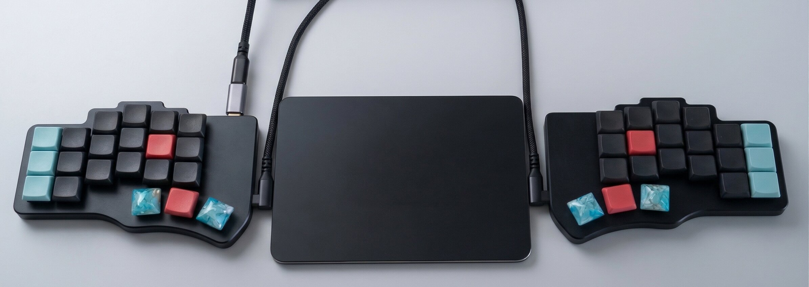

# heavy-handed

This is a 42-key split keyboard layout for the Piantor Pro with Nocturnal Silent Linear 20g switches.
The switches activate if you breathe on them. The name is aspirational.



The full story is at [Twelve Keyboards Later](https://jorypestorious.com/blog/endgame-keyboard/).

---

## Firmware

Two versions of this layout exist. Use whichever matches your firmware.

### Original: stock Vial firmware

`piantor-pro-heavy-handed.vil` works with the stock Vial firmware that ships with beekeeb's Piantor Pro.
Download Vial from [get.vial.today](https://get.vial.today/), open the `.vil` file, and flash.
No build required.

### Custom: vial-qmk with Flow Tap and QMK Settings

`piantor-pro-heavy-handed-v2.vil` requires the custom firmware (`beekeeb_piantor_pro_vial.uf2`) built from this repo.

**What the custom firmware adds:**

- **Flow Tap.** If the previous keypress was within 150ms, layer-tap keys like Space/L2 force tap behavior instead of activating the layer. This eliminates accidental tmux splits and other layer misfires during fast typing.
- **QMK Settings tab in Vial.** Exposes tapping term, flow tap term, quick tap term, and other timing values as live sliders you can tune without reflashing.
- **QK_BOOT key.** Tab + Ctrl (top-left) enters bootloader. No physical reset button or disassembly needed.

**How to flash:**

1. Load `piantor-pro-heavy-handed-v2.vil` in Vial first so QK_BOOT is live on the keyboard.
2. Press Tab + Ctrl (hold Tab, tap the top-left Ctrl key). The keyboard mounts as `RPI-RP2`.
3. Copy `beekeeb_piantor_pro_vial.uf2` onto the `RPI-RP2` drive. It reboots automatically.
4. Open Vial and load `piantor-pro-heavy-handed-v2.vil` again.
5. Go to the QMK Settings tab and confirm Flow Tap Term is 150ms.

**UID note:** The custom firmware has a unique keyboard UID baked into the keymap at `keyboards/beekeeb/piantor_pro/keymaps/vial/config.h`. This UID is what allows Vial to match a `.vil` file to your keyboard. If you build your own firmware and generate a different UID, update `VIAL_KEYBOARD_UID` in that file before compiling, then save a fresh `.vil` from Vial after loading your layout.

**How to rebuild the firmware** (the compiled `.uf2` is included, so this is optional):

```bash
git clone https://github.com/vial-kb/vial-qmk.git ~/vial-qmk --depth=1
cd ~/vial-qmk
git submodule update --init --recursive
qmk config user.qmk_home=~/vial-qmk
make beekeeb/piantor_pro:vial
```

Flow Tap is enabled automatically by Vial's QMK Settings feature. No source changes are needed beyond what is in the `keymaps/vial/` directory.

---

## Philosophy

Every key serves one purpose. The layout has no redundant layers.

The six thumb keys handle five layers and the five most frequent non-alpha keys
(Backspace, Space, Tab, Escape, and mouse click). Modifiers stay on the outer pinky columns:
Ctrl (top left), Cmd (home left), Alt (top right), Shift-parens (bottom both).

The right outer thumb is Escape on tap, Hyper (all four modifiers) on hold.
Escape is the most common single-key action in vim and tmux.
Hyper gives skhd a dedicated modifier namespace for app launching, separate
from Alt (window management) and Ctrl (tmux).

**Ghost glyph protection:** the inner column keys (T/G/B and Y/H/N positions)
are blank on most layers. Insert used to live on the G position of L2, and it
fired constantly. Blanking the inner column on layers where it serves no purpose
fixed the problem. The inner column still carries content on some layers (L1 puts
brackets on Y and equals on H; L3 puts symbols across the right inner column)
where those keys are intentional targets.

**Why not home row mods?** At 20g actuation force, fingers rest on the keys with
enough pressure to register. Fast typing holds keys for 100-150ms during normal
rollover, which overlaps with the tapping term threshold. The firmware cannot
reliably distinguish "typing A quickly" from "starting to hold Cmd." Dedicated
modifier keys have no timing ambiguity. Ctrl is always Ctrl.

---

## Base Layer

```
+-----+-----+-----+-----+-----+-----+          +-----+-----+-----+-----+-----+-----+
|Ctrl |  Q  |  W  |  E  |  R  |  T  |          |  Y  |  U  |  I  |  O  |  P  | Alt |
+-----+-----+-----+-----+-----+-----+          +-----+-----+-----+-----+-----+-----+
| Cmd |  A  |  S  |  D  |  F  |  G  |          |  H  |  J  |  K  |  L  |  ;  |  '  |
+-----+-----+-----+-----+-----+-----+          +-----+-----+-----+-----+-----+-----+
|Sft/(|  Z  |  X  |  C  |  V  |  B  |          |  N  |  M  |  ,  |  .  |  /  |Sft/)|
+-----+-----+-----+-----+-----+-----+          +-----+-----+-----+-----+-----+-----+
                    +-----+-----+-----+    +-----+-----+-----+
                    | Tab |BkSp |Enter|    |Click|Space| Esc |
                    | L5  | L1  | L3  |    | L4  | L2  |Hyper|
                    +-----+-----+-----+    +-----+-----+-----+
```

**Left outer column** holds Ctrl (top), Cmd (home), and Shift/( (bottom).
Cmd on the left home pinky keeps one-handed Cmd+ZXCV comfortable.

**Right outer column** holds Alt (top), quote (home), and Shift/) (bottom).

**Left thumbs** are Tab/L5, Backspace/L1, and Enter/L3.
Tab sits on the outer thumb because it is used constantly. Del lives on L2.

**Right thumbs** are Click/L4, Space/L2, and Esc/Hyper.
The right inner thumb taps left-click and holds for the mouse layer.

---

## Layers

| Hold | Layer | Purpose |
|------|-------|---------|
| Backspace | L1 Num | Numbers, brackets |
| Space | L2 Nav | Arrows, editing, all tmux controls |
| Enter | L3 Sym | Shifted symbols, yabai window management |
| Right inner thumb | L4 Mouse | Mouse movement, scroll, buttons |
| Tab | L5 Fn | F-keys, media, brightness |

### L1 Num (hold Backspace)

The right hand holds a numpad with brackets. The left hand has format separators, bracket pairs,
and math operators for number-adjacent input without leaving the numpad.

```
+-----+-----+-----+-----+-----+-----+          +-----+-----+-----+-----+-----+-----+
|Ctrl |  {  |  (  |  )  |  }  |     |          |  [  |  7  |  8  |  9  |  ]  | Alt |
+-----+-----+-----+-----+-----+-----+          +-----+-----+-----+-----+-----+-----+
| Cmd |  $  |  .  |  ,  |  :  |     |          |  =  |  4  |  5  |  6  |  ;  |  '  |
+-----+-----+-----+-----+-----+-----+          +-----+-----+-----+-----+-----+-----+
|Sft/(|  /  |  *  |  +  |  %  |     |          |  \  |  1  |  2  |  3  |  `  |Sft/)|
+-----+-----+-----+-----+-----+-----+          +-----+-----+-----+-----+-----+-----+
                    +-----+-----+-----+    +-----+-----+-----+
                    |     |(hld)|     |    |  -  |  0  |  .  |
                    +-----+-----+-----+    +-----+-----+-----+
```

### L2 Nav + tmux (hold Space)

The left hand handles arrows and editing. The right hand controls all of tmux.

```
+-----+-----+-----+-----+-----+-----+          +-----+-----+-----+-----+-----+-----+
|Ctrl |Home |PgDn |PgUp | End |     |          |     |splth|spltv|zoom |copy | Alt |
+-----+-----+-----+-----+-----+-----+          +-----+-----+-----+-----+-----+-----+
| Cmd |Left |Down | Up  |Right|     |          |prevW|nextS|prevS|nextW|sesh |     |
+-----+-----+-----+-----+-----+-----+          +-----+-----+-----+-----+-----+-----+
|Sft/(|Cmd+Z|Cmd+X|Cmd+C|Cmd+V|CmdSZ|          |     | git | jump|newWn| yazi|     |
+-----+-----+-----+-----+-----+-----+          +-----+-----+-----+-----+-----+-----+
                    +-----+-----+-----+    +-----+-----+-----+
                    | Del |BkSp |Enter|    |     |(hld)|     |
                    +-----+-----+-----+    +-----+-----+-----+
```

### L3 Sym + yabai (hold Enter)

The right hand holds shifted symbols. The left hand controls yabai window management.

```
+-----+-----+-----+-----+-----+-----+          +-----+-----+-----+-----+-----+-----+
|Ctrl |rsz← |rsz↓ |rsz↑ |rsz→ |     |          |  {  |  &  |  *  |  (  |  }  | Alt |
+-----+-----+-----+-----+-----+-----+          +-----+-----+-----+-----+-----+-----+
| Cmd |fcs← |fcs↓ |fcs↑ |fcs→ |     |          |  +  |  $  |  %  |  ^  |  :  |  "  |
+-----+-----+-----+-----+-----+-----+          +-----+-----+-----+-----+-----+-----+
|Sft/(|swp← |swp↓ |swp↑ |swp→ |     |          |  |  |  !  |  @  |  #  |  ~  |Sft/)|
+-----+-----+-----+-----+-----+-----+          +-----+-----+-----+-----+-----+-----+
                    +-----+-----+-----+    +-----+-----+-----+
                    |full |rotat|(hld)|    |  _  |  (  |  )  |
                    +-----+-----+-----+    +-----+-----+-----+
```

### L4 Mouse (hold right inner thumb)

The left hand controls cursor and scroll. The right hand has one-handed editing shortcuts.

```
+-----+-----+-----+-----+-----+-----+          +-----+-----+-----+-----+-----+-----+
|Ctrl |Scr L|Scr D|Scr U|Scr R|     |          |     |newTb|close|save |slAll| Alt |
+-----+-----+-----+-----+-----+-----+          +-----+-----+-----+-----+-----+-----+
| Cmd |Mse L|Mse D|Mse U|Mse R|     |          |     |undo | cut |copy |paste|     |
+-----+-----+-----+-----+-----+-----+          +-----+-----+-----+-----+-----+-----+
|     |     |     |     |     |     |          |     |redo |find |     |     |     |
+-----+-----+-----+-----+-----+-----+          +-----+-----+-----+-----+-----+-----+
                    +-----+-----+-----+    +-----+-----+-----+
                    | Mid |Click|Right|    |(hld)|     |     |
                    +-----+-----+-----+    +-----+-----+-----+
```

### L5 Fn + Media (hold Tab)

F-keys live on the right hand. Media controls sit on the left home row. Brightness is on the right pinky.
The H position holds a plain Space for Claude Code voice mode (hold Tab, hold H).
On the custom firmware, the top-left Ctrl position holds QK_BOOT (hold Tab, tap Ctrl) to enter bootloader.

```
+-----+-----+-----+-----+-----+-----+          +-----+-----+-----+-----+-----+-----+
|Boot |     |     |     |     |     |          |     | F7  | F8  | F9  | F12 |ScSht|
+-----+-----+-----+-----+-----+-----+          +-----+-----+-----+-----+-----+-----+
|     |Mute |Vol- |Vol+ |Play |     |          |Space| F4  | F5  | F6  | F11 |Bri+ |
+-----+-----+-----+-----+-----+-----+          +-----+-----+-----+-----+-----+-----+
|     |     |     |     |     |     |          |     | F1  | F2  | F3  | F10 |Bri- |
+-----+-----+-----+-----+-----+-----+          +-----+-----+-----+-----+-----+-----+
                    +-----+-----+-----+    +-----+-----+-----+
                    |(hld)|     |     |    | M0  | M1  | M2  |
                    +-----+-----+-----+    +-----+-----+-----+
```

---

## Macros

| Slot | Keys | Purpose | Layer | Position |
|------|------|---------|-------|----------|
| M0 | RAlt+Space | Raycast launcher | L5 | right thumb outer |
| M1 | LAlt+D | Wispr transcription | L5 | right thumb middle |
| M2 | Ctrl+A | tmux prefix (raw) | L5 | right thumb inner |
| M3 | Ctrl+A, [ | tmux copy mode | L2 | P position |
| M4 | Ctrl+A, - | tmux split horizontal | L2 | U position |
| M5 | Ctrl+A, \| | tmux split vertical | L2 | I position |
| M6 | Ctrl+A, z | tmux zoom pane | L2 | O position |
| M7 | Ctrl+A, g | lazygit popup | L2 | M position |
| M8 | Ctrl+A, a | sesh session picker | L2 | ; position |
| M9 | Ctrl+A, j | zoxide directory jump | L2 | , position |
| M10 | Ctrl+A, c | new tmux window | L2 | . position |
| M11 | Ctrl+A, y | yazi file manager popup | L2 | / position |
| M12 | Alt+P | tmux previous window | L2 | H position |
| M13 | Alt+N | tmux next window | L2 | L position |
| M14 | Alt+Y | tmux previous session | L2 | K position |
| M15 | Alt+U | tmux next session | L2 | J position |

---

## Shared Configs

The keyboard layout is one layer in a stack. The configs in this repo are the
shared bindings that connect the Piantor to the rest of the environment.

```
skhd/           yabai + skhd hotkey daemon config
  skhdrc        Three modifier domains: Alt (windows), Hyper (apps), Ctrl+Alt/Shift+Alt (L3 layer)
  cycle-display.sh   Multi-monitor focus cycling (skips overlay apps)

tmux/           tmux terminal multiplexer config
  tmux.conf     Prefix Ctrl+A, sesh, popups (lazygit/yazi/btop), vim-tmux-navigator
  clipboard-image.sh   Paste clipboard image to pane working directory
```

Karabiner-Elements handles two OS-level remaps for the MacBook built-in keyboard:
Cmd+HJKL arrows from home position, and Caps Lock as Ctrl (tap Escape).

---

## Hardware

- **Board:** [Piantor Pro](https://github.com/beekeeb/piantor) 42-key split, aluminum case
- **Switches:** Nocturnal Silent Linear 20g (lightest available, silent)
- **Keycaps:** [CS Chicago Stenographer](https://www.asymplex.xyz/product/cs-chicago-stenographer-profile) (cold-cast resin, porcelain feel, Choc-compatible)
- **Firmware:** [Vial](https://get.vial.today/) (QMK fork with live configuration)
